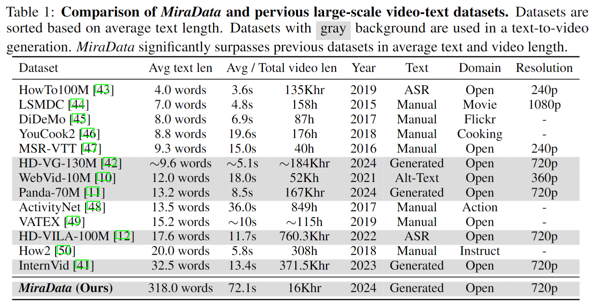
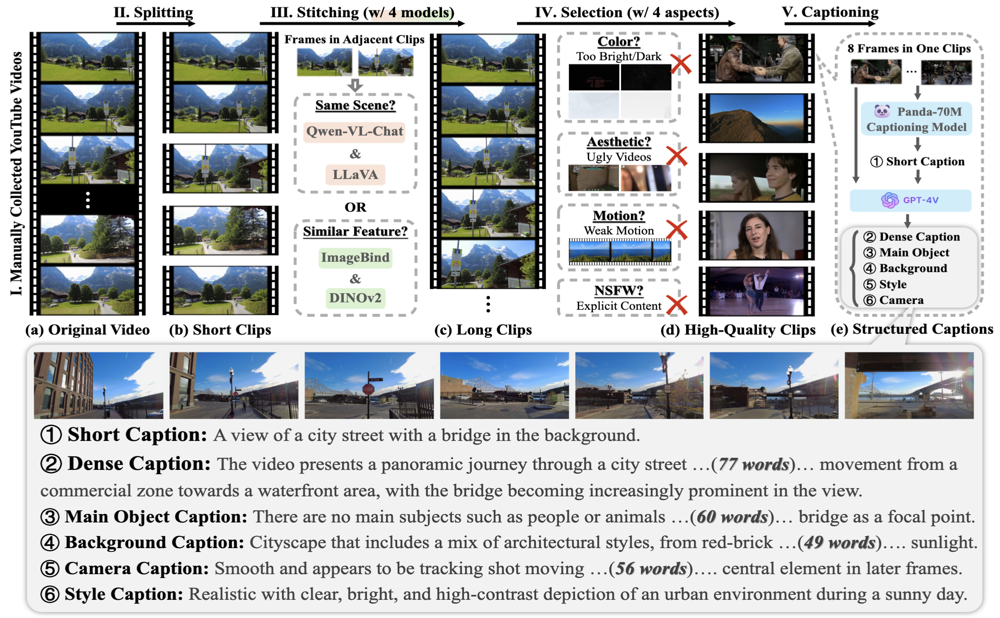
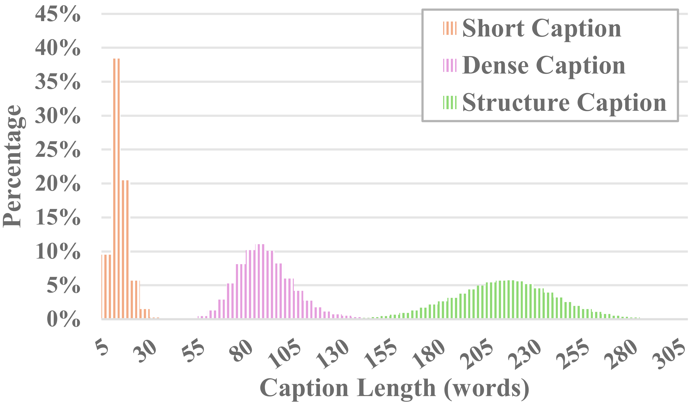
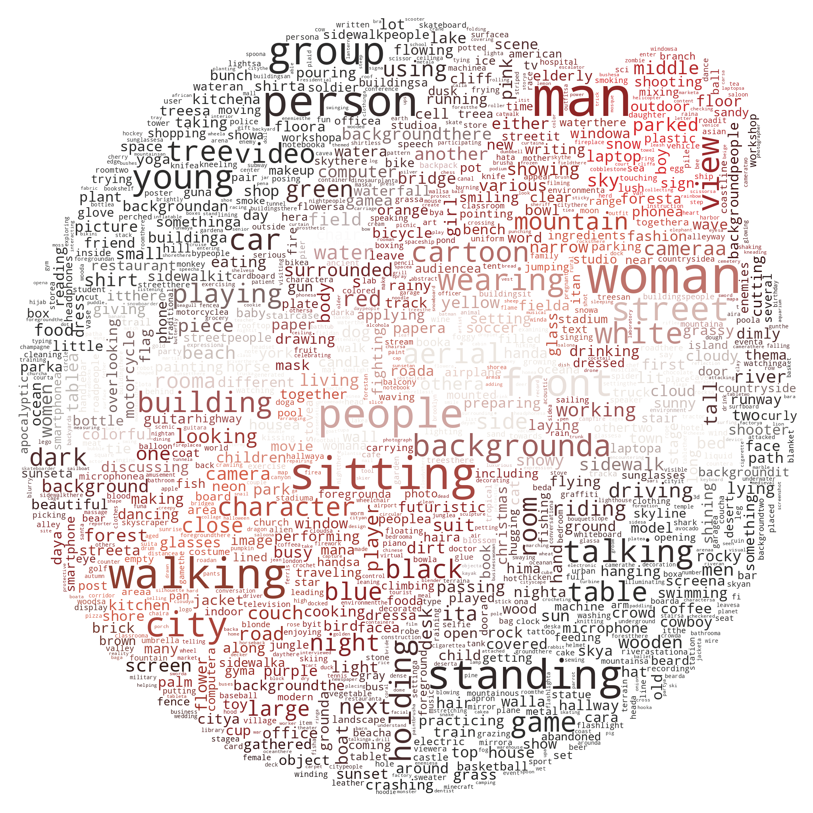
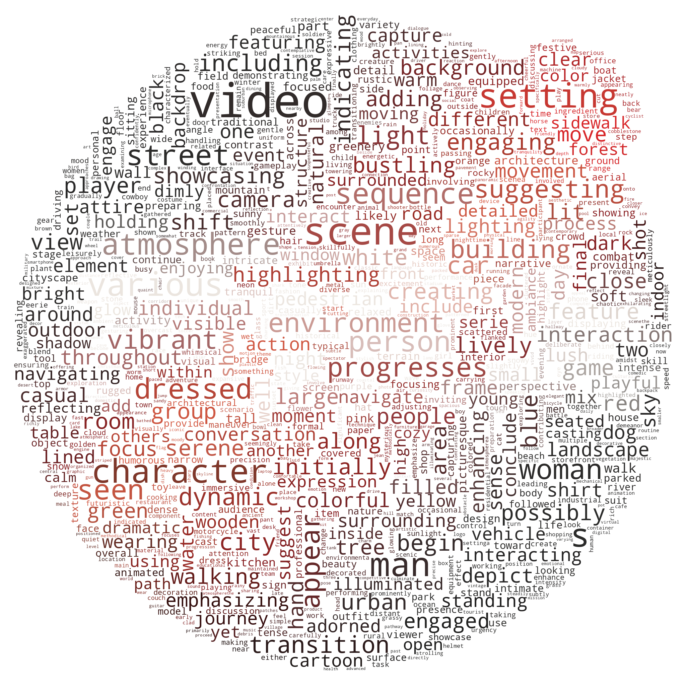

<p align="center">
  
</p>

<div align="center">

## MiraData: A Large-Scale Video Dataset with Long Durations and Structured Captions

> [Xuan Ju](https://juxuan27.github.io/)<sup>1*</sup>, [Yiming Gao](https://scholar.google.com/citations?user=uRCc-McAAAAJ&hl=zh-TW)<sup>1*</sup>, [Zhaoyang Zhang](https://zzyfd.github.io/)<sup>1*#</sup>, [Ziyang Yuan](https://github.com/jiangyzy)<sup>1</sup>,  [Xintao Wang](https://xinntao.github.io/)<sup>1</sup>,  [Ailing Zeng](https://ailingzeng.site/), [Yu Xiong](https://scholar.google.com/citations?user=7P30Es0AAAAJ&hl=en), [Qiang Xu](https://scholar.google.com/citations?user=eSiKPqUAAAAJ&hl=zh-CN),  [Ying Shan](https://www.linkedin.com/in/YingShanProfile/)<sup>1</sup> <br>
> <sup>1</sup>ARC Lab, Tencent PCG  <sup>2</sup>The Chinese University of Hong Kong  <sup>*</sup>Equal Contribution  <sup>#</sup>Project Lead

[](https://arxiv.org/abs/2407.06358v1) [](https://mira-space.github.io/) [](https://drive.google.com/drive/folders/1U9x6VeasgjxSuuKcCgY6K8CVy9EKEt80?usp=sharing)
</div>

## Introduction

Video datasets play a crucial role in video generation such as [Sora](https://openai.com/sora).
However, existing text-video datasets often fall short when it comes to **handling long video sequences** and **capturing shot transitions**.
To address these limitations, we introduce **MiraData**, a video dataset designed specifically for long video generation tasks.
Moreover, to better assess temporal consistency and motion intensity in video generation, we introduce **MiraBench**, which enhances existing benchmarks by adding 3D consistency and tracking-based motion strength metrics. 
You can find more details in our [research papaer]().

### Key Features of MiraData

1. **Long Video Duration**: Unlike previous datasets, where video clips are often very short (typically less than 20 seconds), MiraData focuses on uncut video segments with durations of an average of 72 seconds. This extended duration allows for more comprehensive modeling of video content.
2. **Structured Captions**: Each video in MiraData is accompanied by structural captions. These captions provide detailed descriptions from various perspectives, enhancing the richness of the dataset. The average caption length is 318 words, ensuring a thorough representation of the video content.




## Dataset

### Meta Files

We release four versions of MiraData, containing 330K, 93K, 42K, 9K data.

The meta file for this version of MiraData is provided [here](https://drive.google.com/drive/folders/1U9x6VeasgjxSuuKcCgY6K8CVy9EKEt80?usp=sharing). Additionally, for a better and quicker understanding of our meta file composition, we randomly sample a set of 100 video clips, which can be accessed [here](assets/miradata_v1_100_samples.csv). The meta file contains the following index information:

- **clip_id**: video clip index, which is composed of `{download_id}.{clip_id}`
- **source**: video download source and category
- **video_url**: video source url
- **video_id**: video id in the source website
- **width**: video width
- **height**: video height
- **fps**: video fps used for extracting frame
- **seconds**: duration of the video clip
- **timestamp**: clip start and end timestamp in source video  (used for cutting the video clip from its source video)
- **frame_number**: frame number of the video clip
- **framestamp**: clip start and end frame in source video
- **file_path**: file path for storing the video clip
- **short_caption**: a short overall caption
- **dense_caption**: a dense overall caption
- **background_caption**: caption of the video background
- **main_object_caption**: caption of the main object in video
- **style_caption**: caption of the video style
- **camera_caption**: caption of the camera move


### Download

To download the videos and split the videos into clips, you can use the following scripts:

```
python download_data.py --meta_csv {meta file} --download_start_id {the start of download id} --download_end_id {the end of download id} --raw_video_save_dir {the path of saving raw videos} --clip_video_save_dir {the path of saving cutted video}
```


<sup>*We will remove the video samples from our dataset / Github / project webpage as long as you need it. Please [contact to us](#Contact-Information) for the request.*</sup>

### Collection and Annotation

To collect the MiraData, we first manually select youtube channels in different scenarios and include videos from [HD-VILA-100M](https://github.com/microsoft/XPretrain/blob/main/hd-vila-100m/README.md), [Videovo](https://www.videvo.net/), [Pixabay](https://pixabay.com/), and [Pexels](https://www.pexels.com/zh-cn/). Then, all the videos in corresponding channels are downloaded and splitted using [PySceneDetect](https://www.scenedetect.com/). We then used multiple models to stitch the short clips together and filter out low-quality videos. Following this, we selected video clips with long durations. Finally, we captioned all video clips using GPT-4V.



#### Structured Captions

Each video in MiraData is accompanied by structured captions. These captions provide detailed descriptions from various perspectives, enhancing the richness of the dataset.

**Six Types of Captions**

- Main Object Description: Describes the primary object or subject in the video, including their attributes, actions, positions, and movements throughout the video.
- Background: Provides context about the environment or setting, including objects, location, weather, and time.
- Style: Covers artistic style, visual and photographic aspects, such as realistic, cyberpunk, and cinematic style.
- Camera Movement: Details any camera pans, zooms, or other movements.
- Short Caption: A concise summary capturing the essence of the video, generated using the [Panda-70M](https://github.com/snap-research/Panda-70M/tree/main/captioning) caption model.
- Dense Caption: A more elaborate and detailed description that summarizes the above five types of captions.

#### Captions with GPT-4V

We tested the existing open-source visual LLM methods and GPT-4V, and found that GPT-4V's captions show better accuracy and coherence in semantic understanding in terms of temporal sequence.

In order to balance annotation costs and caption accuracy, we uniformly sample 8 frames for each video and arrange them into a 2x4 grid of one large image. Then, we use the caption model of [Panda-70M](https://github.com/snap-research/Panda-70M/tree/main/captioning) to annotate each video with a one-sentence caption, which serves as a hint for the main content, and input it into our fine-tuned prompt. By feeding the fine-tuned prompt and a 2x4 large image to GPT-4V, we can efficiently output captions for multiple dimensions in just one round of conversation. The specific prompt content can be found in the [caption_gpt4v.py](caption_gpt4v.py), and we welcome everyone to contribute to the more high-quality text-video data. :raised_hands:


<div style="display:inline-block" align=center>
     
<!--      -->
</div>

<div style="display:inline-block" align=center> Text length statistics of short, dense and structure captions.</div>


<div style="display:inline-block" align=center>
     
    
</div>

<div style="display:inline-block" align=center>Word cloud of short captions. &nbsp;&nbsp;&nbsp;&nbsp;&nbsp;&nbsp;&nbsp;&nbsp;&nbsp;&nbsp;&nbsp;&nbsp;&nbsp;&nbsp;&nbsp; Word cloud of dense captions.</div>


## Benchmark - MiraBench

To evaluate long video generation, we design 17 evaluation metrics in MiraBench from 6 perspectives, including temporal consistency, temporal motion strength, 3D consistency, visual quality, text-video alignment, and distribution consistency. These metrics encompass most of the common evaluation standards used in previous video generation models and text-to-video benchmarks.

To evaluate generated videos, please first set up python environment through:

```
pip install torch==1.12.1+cu116 torchvision==0.13.1+cu116 torchaudio==0.12.1 --extra-index-url https://download.pytorch.org/whl/cu116
pip install -r requirements.txt
```

Then, run evaluation through:

```
python calculate_score.py --meta_file data/evaluation_example/meta_generated.csv --frame_dir data/evaluation_example/frames_generated --gt_meta_file data/evaluation_example/meta_gt.csv --gt_frame_dir data/evaluation_example/frames_gt --output_folder data/evaluation_example/results --ckpt_path data/ckpt --device cuda
```

You can follow the example in `data/evaluation_example` to evaluate your own generated videos.

## License Agreement

Please see [LICENSE](./LICENSE).

- The MiraData dataset is only available for informational purposes only. The copyright remains with the original owners of the video.
- All videos of the MiraData dataset are obtained from the Internet which are not property of our institutions. Our institution are not responsible for the content nor the meaning of these videos.
- You agree not to reproduce, duplicate, copy, sell, trade, resell or exploit for any commercial purposes, any portion of the videos and any portion of derived data. You agree not to further copy, publish or distribute any portion of the MiraData dataset.

## Citation

If you find this project useful for your research, please cite our paper. :blush:

```
@misc{ju2024miradatalargescalevideodataset,
      title={MiraData: A Large-Scale Video Dataset with Long Durations and Structured Captions}, 
      author={Xuan Ju and Yiming Gao and Zhaoyang Zhang and Ziyang Yuan and Xintao Wang and Ailing Zeng and Yu Xiong and Qiang Xu and Ying Shan},
      year={2024},
      eprint={2407.06358},
      archivePrefix={arXiv},
      primaryClass={cs.CV},
      url={https://arxiv.org/abs/2407.06358}, 
}
```

## Contact Information

For any inquiries, please email `mira-x@googlegroups.com`.
